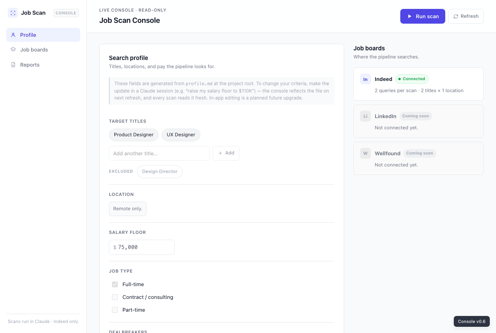
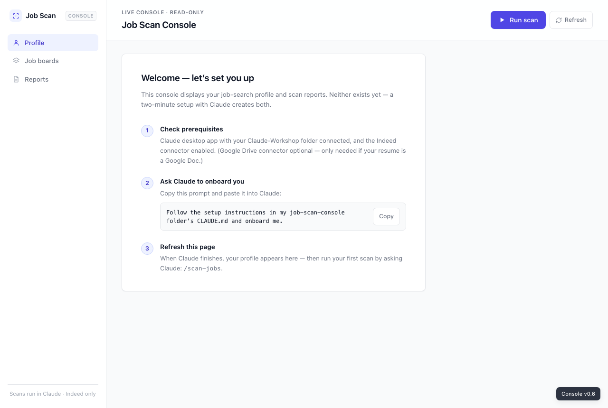
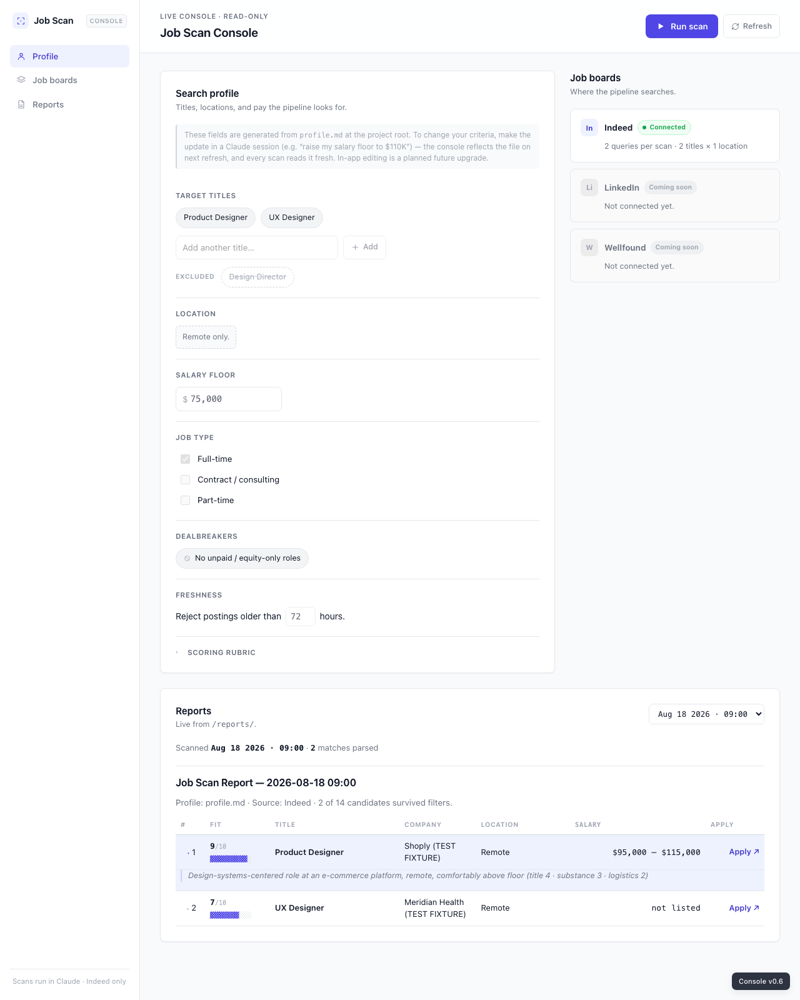

# Job Scan Console — user guide

Job Scan Console is a personal job-search system you run through Claude — it searches Indeed against criteria you set, scores every listing against your own background, and saves the results as reports you can browse anytime. Claude does the actual searching and scoring inside your chat sessions; the console is just the dashboard you read the results in; and your resume, profile, and reports stay on your machine the whole time.

## What you'll end up with

Once setup is done, you'll have:

- **`/scan-jobs`** — a Claude skill you invoke any time you want a fresh scan
- **`profile.md`** — your search profile: target titles, location, salary floor, dealbreakers, and a scoring rubric written around your background
- **`resume.md`** — a markdown copy of your resume that Claude reads instead of re-parsing the original file every time
- **`facts.md`** — a registry of the facts pulled from your résumé, in your résumé's own words, plus a few things you've done that never made it onto the résumé itself; this is what your tailored résumés get checked against later
- **The console** — a local dashboard that shows your profile and every report you've run


*Sample data — "Jordan Lee" is a fictional example profile, not a real person or account.*

## Before you start

- The Claude desktop app, with your `Claude-Workshop` folder connected
- The **Indeed connector** added to your Claude account — go to **Settings → Connectors** and add **Indeed**. Without it, scans can't run.
- Your resume as a PDF (or `.docx`) somewhere inside your `Claude-Workshop` folder
- If your resume is a Google Doc: use **File → Download → PDF** to save a copy into the folder, or connect the **Google Drive connector** so Claude can fetch it directly
- A Mac with `python3` installed — it serves the dashboard locally, and it's also what runs the honesty check behind `/apply` (below), so it's a real requirement now, not just a convenience

## Install and onboard (one prompt)

Open Claude with your `Claude-Workshop` folder connected, and paste this exact prompt:

```
Download https://github.com/ai-build-club-dc/job-scan-console into my Claude-Workshop folder, then follow the setup instructions in job-scan-console/CLAUDE.md and onboard me.
```

Claude takes it from there. Here's what happens next:

1. **Finds your resume.** Claude looks for a PDF or `.docx` in the new `job-scan-console` folder and in `Claude-Workshop` itself. If it can't find one, it'll ask you where it is.
2. **Writes `resume.md`.** A faithful markdown transcription of your resume, saved next to the original file — outside the `job-scan-console` folder, so it's never part of the repo. From this point on, `resume.md` is what Claude actually reads.
3. **Builds your fact registry.** Claude pulls every number, title, date range, and credential out of `resume.md` into a new file, `facts.md`, quoting your résumé's own wording for each one — so checking it means comparing it to your résumé, not passing a quiz. You confirm it's right, then Claude asks a few questions about wins that never made it onto the résumé itself. This registry is what your tailored résumés get checked against later, so it's worth doing carefully.
4. **Interviews you.** A short back-and-forth: your target titles (2–3, plus anything you explicitly don't want to see), location, salary floor, job type, dealbreakers, and how fresh a posting has to be (defaults to 48 hours).
5. **Writes your `profile.md`.** Your interview answers, plus a scoring rubric written specifically around your background — more on how that scoring works below.
6. **Starts the console.** Claude runs a small local server and gives you a link to open.
7. **Offers your first scan.** Claude asks if you'd like to run `/scan-jobs` right away, and whether you want a daily scan scheduled automatically.

> You'll see: a handful of permission prompts along the way, as Claude asks to run shell commands to download the repo and start the server. Clicking **Allow** is normal and expected — that's just Claude checking in before it touches your machine.

The whole process takes about fifteen minutes, split mostly between building your fact registry in step 3 and the interview in step 4.

### Manual alternative

If you'd rather not have Claude download anything itself:

1. On the repo page, click **Code → Download ZIP**, then unzip it into your `Claude-Workshop` folder so it's named `job-scan-console`.
2. Open Claude in that folder and say: *"Follow the setup instructions in CLAUDE.md and onboard me."*

From here, onboarding proceeds exactly as described above.

## The console

Once onboarding finishes, your dashboard lives at `http://localhost:8642/console/`. It has three panels, listed in the left sidebar:

- **Profile** — a read-only view of `profile.md`: target titles, location, salary floor, job type, dealbreakers, and freshness rule. Near the bottom, a collapsible **Scoring rubric** section shows exactly how your fit scores get calculated.
- **Job boards** — shows Indeed as **Connected**. Other boards are listed too, marked **Coming soon** — they're not wired up yet.
- **Reports** — a dropdown picker over every scan you've run, each one shown as a table of matches.

Everything here is read-only. There's no in-app editing — to change anything, you ask Claude in a session, and the console picks up the updated file the next time you click **Refresh** (top right). A **Run scan** button is there too, but clicking it just explains this same thing: the console can't execute a scan itself, because scanning only happens inside a Claude session.


*Sample screen — if you ever open the console before onboarding is finished, this Welcome panel appears with its own copy-paste prompt and a Copy button. Use that one instead of the prompt above — by this point the repo is already on your machine, so it skips the download step.*

## Running scans and reading fit scores

Ask Claude, in a session opened in `job-scan-console`: `/scan-jobs`

You can also paste specific job postings or links in the same message — Claude scores those alongside the automatic Indeed search, using the same rubric.

> You'll see: after the scan finishes, a short chat summary — how many results it found, the top few by score, and the file path of the new report. Claude won't dump the whole report into the chat; the file itself is the artifact.

Claude writes one new report per run into `reports/`, named for the date and time. Each entry lists the job title and company, location, salary (or "not listed" if the posting doesn't show one), a fit score, a one-line "Why," and a real apply link.

Every job is scored out of 10, built from three parts:

- **Title match (0–4)** — how closely the role matches one of your target titles
- **Substance (0–4)** — how well the actual work matches your background; this dimension is personalized to you during onboarding, built from your resume
- **Logistics (0–2)** — how cleanly location and salary line up with no friction, versus things like a hybrid requirement or a salary band that straddles your floor

Only jobs scoring 6/10 or higher make it into the report, and each report is capped at 10 results. The "Why" line always carries the breakdown, so you can see exactly how a score adds up — something like *(title 4 · substance 3 · logistics 2)*.

After your first scan, Claude will offer to record a few real results as **Calibration anchors** in your rubric — short examples like "Shoply Product Designer: 4+3+2 = 9" — so future scans stay consistent with how you actually judged the results.


*Sample report — "Shoply" and "Meridian Health" are fictional test-fixture companies, not real employers.*

## Building an application package

Once you've found a job worth pursuing — in the console, or in a report Claude showed you in chat — ask Claude: `/apply <company name>` (add the role too if that company has more than one posting across your reports).

### Applying to a job you found yourself

Found something outside a scan entirely — on LinkedIn, a company's careers page, Greenhouse, a link a friend sent you — and want a package for it anyway? Paste the link straight into `/apply`:

    /apply https://boards.greenhouse.io/acme/jobs/12345

One URL at a time: `/apply` can't take more than one link in a message, and it can't mix a pasted URL with company names. If you've got several jobs in mind, run `/apply` again for each one.

A job that arrives this way is different in two ways worth knowing before you build it:

- **No fit score.** Nothing has scored this job against your rubric, so instead of a number out of 10, the manifest and every file in the package show `unscored`. That number is normally your early warning — it's what tells you whether a job is worth the effort *before* you spend it. With a pasted URL, that signal just isn't there; the closest thing you get back is `gap-analysis.md`, and that only arrives at the very end, after the package is already built. (The manifest reflects this too: instead of naming which report the job came from, it shows the link you pasted.)
- **It will not show up in your console.** The console only reads `reports/`, and a URL-sourced job is never written there — the whole package lives in `applications/<company>-<role>/` instead. If you go looking for it on your dashboard afterward and don't find it, that's expected, not a sign the build failed.

If the link doesn't fetch cleanly — a login wall, a dead link, a site that blocks automated reads — see the troubleshooting table below; it's handled differently for a pasted URL than for a scan-sourced job. Past that, everything else about `/apply` works the same from here: the manifest, the `go` reply, the six files it builds.

Claude first prints a **manifest**: the company, role, fit score, which report it came from, the files it's about to write, where they'll land, and roughly how many web pages it plans to fetch for company research. **Nothing is created until you reply.** Say `go` to build it, or, if you're doing several at once, `go, skip <company>` to leave one out. If you ask Claude to "process my queue," it'll tell you plainly that it can't see the console's Queue panel — that list only lives in your browser — and show you a numbered list to pick from instead, rather than guessing which jobs you meant.

Once you say go, Claude builds a folder — `applications/<Company>-<Role-Title>/` — with six files:

| File | What it's for |
|---|---|
| `job-post.md` | The job posting in markdown, with a link back to where it came from |
| `company-context.md` | Research on the company — what they do, size, recent news, why it might fit — every claim with a link to a page Claude actually fetched this run |
| `tailored-resume.md` | Your résumé, rewritten for this specific job |
| `gap-analysis.md` | What the posting asks for, checked against your fact registry — what you clearly evidence, partially evidence, or don't |
| `notes.md` | A tracker for this application — status, dates, anything you want to log by hand as things move |
| `lint-report.md` | The honesty check on `tailored-resume.md` — see below |

If this is your first time running `/apply` and you set up `job-scan-console` before this feature existed, you won't have a `facts.md` yet. Claude will notice and offer to build it on the spot — the same process as step 3 of onboarding — before it shows you the manifest.

### Reading `lint-report.md`

This file lists every factual claim in `tailored-resume.md` and says, for each one, which row of `facts.md` backs it up — or `NO SOURCE` if nothing does. It also flags specific problems automatically: numbers that don't match your registry, date ranges that don't line up, credentials it can't trace, and self-reported claims (things you told Claude during the interview, rather than things pulled from your actual résumé) that haven't been confirmed yet.

Two labels show up: **WARN** and **ERROR**. `NO SOURCE` and any ERROR are worth checking closely — that's a claim in your résumé with nothing in your registry behind it. A WARN on a self-reported claim just means it came from something you said rather than a document; if you're confident in it, tell Claude to **attest** it (a one-time "I stand behind this and can defend it in an interview"), and it stops warning on that claim from then on.

Edited `tailored-resume.md` by hand after reading the report? Ask Claude to re-lint that folder and it'll refresh `lint-report.md` against your edits — it won't rebuild anything else in the folder.

## What "passing the check" doesn't mean

Read this before you send anything `/apply` produces anywhere.

`tailored-resume.md` and `gap-analysis.md` make claims about you and your work — Claude writes them, but they go out under your name. The lint report catches one specific, narrow thing: whether a claim traces back to something in your fact registry. It does **not** catch whether a claim is a *fair description of what actually happened*, and it never blocks anything — `lint-report.md` is a passive report, not a gate; it always finishes and never stops a file from being written. A result that says "0 `NO SOURCE`, 0 ERROR" means every claim traces to a source. It does not mean the résumé is honest.

Here's the gap: a claim can trace perfectly and still be a stretch. If `facts.md` has a row saying "coordinated sprint planning," and `tailored-resume.md` turns that into "owned the product roadmap," the lint sees a traceable claim and says nothing, because a source technically exists. It has no way to notice that "coordinated" quietly became "owned." That's not a bug in the check — no automated check can tell overstatement apart from an accurate rewrite. It's why `gap-analysis.md` ends with a question instead of a verdict: *can you defend this out loud, in an interview, without walking it back?*

So before you send anything: read the tailored résumé line by line yourself, not just the lint report. Anything you couldn't say out loud and defend under a follow-up question — anything you'd wince at if a recruiter said "tell me more about that" — take it out or reword it down to what actually happened. The check tells you what's sourced. Only you can tell what's true.

## Changing your profile

Your profile isn't a settings page you edit directly — you just tell Claude what to change, in a session opened in `job-scan-console`. For example:

- *"Raise my salary floor to $95K"*
- *"Add Product Owner to my target titles"*
- *"Switch me to remote only"*

Claude edits `profile.md` directly, and the next scan (or console refresh) reflects the change right away. Resume edits work the same way — ask Claude to update `resume.md` and it will.

## Automatic daily scans (optional)

If you'd rather not remember to run `/scan-jobs` yourself, ask Claude: *"Schedule a daily morning job scan."* From then on, a fresh report lands in `reports/` each morning the Claude app is open at scan time. (Laptop was closed? Just ask for a scan manually.)

Scheduled runs follow the same rule as manual ones: they never invent results. If the Indeed connector isn't available when a scheduled scan tries to run, the report says so plainly instead of pretending to have found something.

## Troubleshooting

| Problem | What to do |
|---|---|
| Scan says the Indeed connector is unavailable | Add the Indeed connector in Claude's settings, then re-run the scan |
| Console shows the Welcome panel, but you already onboarded | `profile.md` is missing or got moved — ask Claude to check |
| Console won't load / connection refused | Ask Claude to "start the job scan console server" |
| You opened `index.html` directly and the page looks broken | It needs to be served over HTTP, not opened as a file — ask Claude to start the server |
| Claude asks permission to run a command | Normal — click **Allow** |
| A report exists but the console doesn't show it | Click **Refresh** (top right) |
| `/apply` says it can't find `facts.md` | Normal the first time you run it if you onboarded before this feature existed — Claude will offer to build the registry from `resume.md` on the spot, before showing you the manifest |
| `/apply` asks which report or job you meant | Normal when a company name matches more than once — name the specific role, or the report date, and it'll narrow it down |
| `lint-report.md` has `NO SOURCE` or ERROR rows | Not a crash — read "What passing the check doesn't mean" above, then check that claim against `facts.md` and your own memory before you send anything |
| A job **from a report** is behind a login or the link is dead | `/apply` still builds `job-post.md` from the report summary alone and marks it "degraded" — the job description content will be thinner than usual |
| A **pasted URL** is behind a login or won't fetch | There's no report summary to fall back on for a URL job, so `/apply` says the fetch failed and asks you to paste the posting text into chat yourself. Paste it and the build continues normally, marked `provenance: user-pasted`; decline and `/apply` stops cleanly with nothing written |

## Updating

Ask Claude: *"Pull the latest job-scan-console."* Your `profile.md`, `facts.md`, `resume.md`, everything in `reports/`, and everything in `applications/` are gitignored, so updates never touch them — you get the newest skill and console code with all your personal data left exactly as it was.

## Privacy

Your resume, profile, fact registry, reports, and application packages live only on your machine. `profile.md`, `facts.md`, `resume.md`, `reports/`, and `applications/` are all gitignored, so none of them can be committed or pushed anywhere — by you or anyone else.

Two things do leave your machine, both by design. The job search itself goes through your own Claude account's Indeed connector. And if you use `/apply` (above), the company-research step fetches roughly five public web pages per application — the company's own site, recent news, that kind of thing — plus the job posting itself.

For a job that came from a scan report, all of that waits for you: `/apply` prints the full plan and fetches nothing until you reply `go`. If you instead paste a link straight into `/apply` (see "Applying to a job you found yourself," above), one fetch happens *before* the plan is printed — the posting you pasted, read once so the manifest can actually tell you which company and role it's about to build for. Nothing else jumps the queue: no company research, no files, no folder — those still wait for `go`, exactly as above. What leaves is Claude reading a page you chose to paste, not your résumé or `facts.md` being sent anywhere — none of your personal data is ever uploaded.
